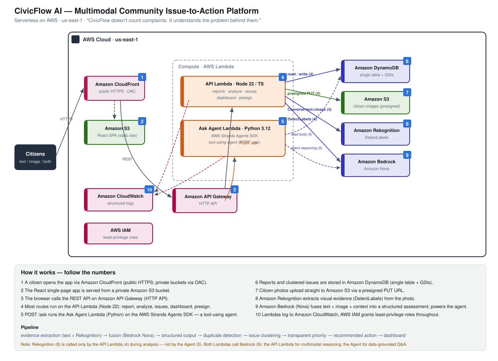
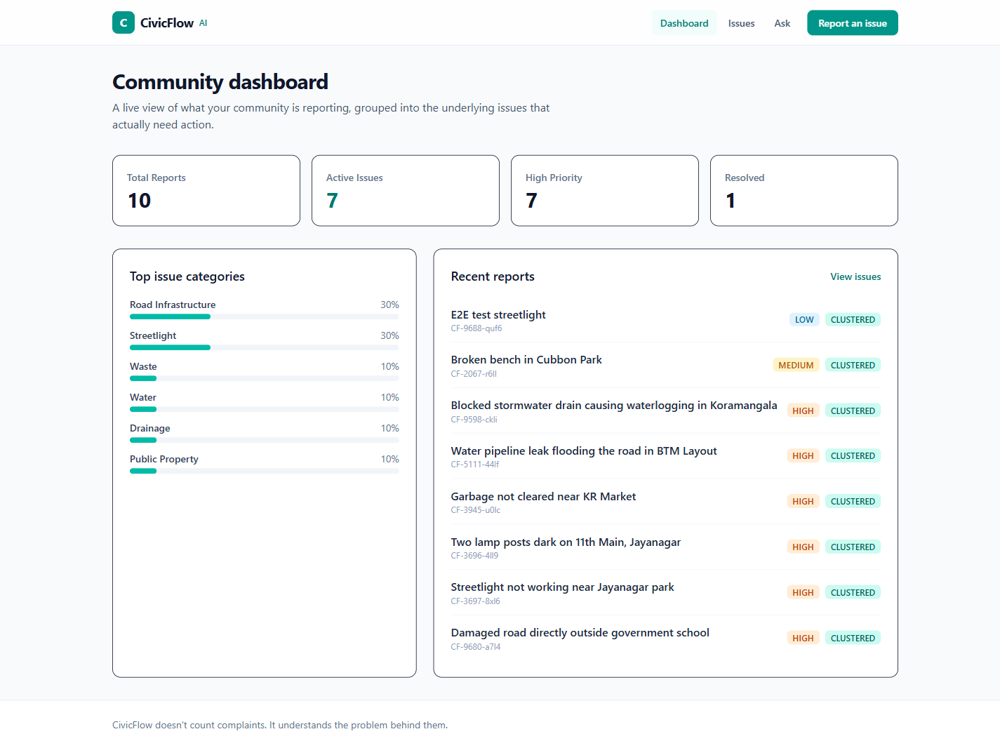
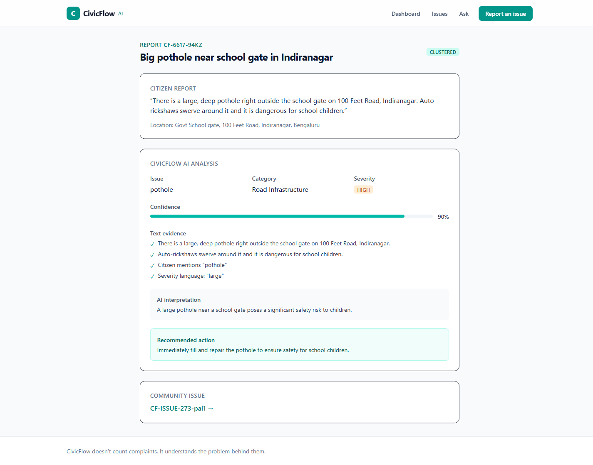
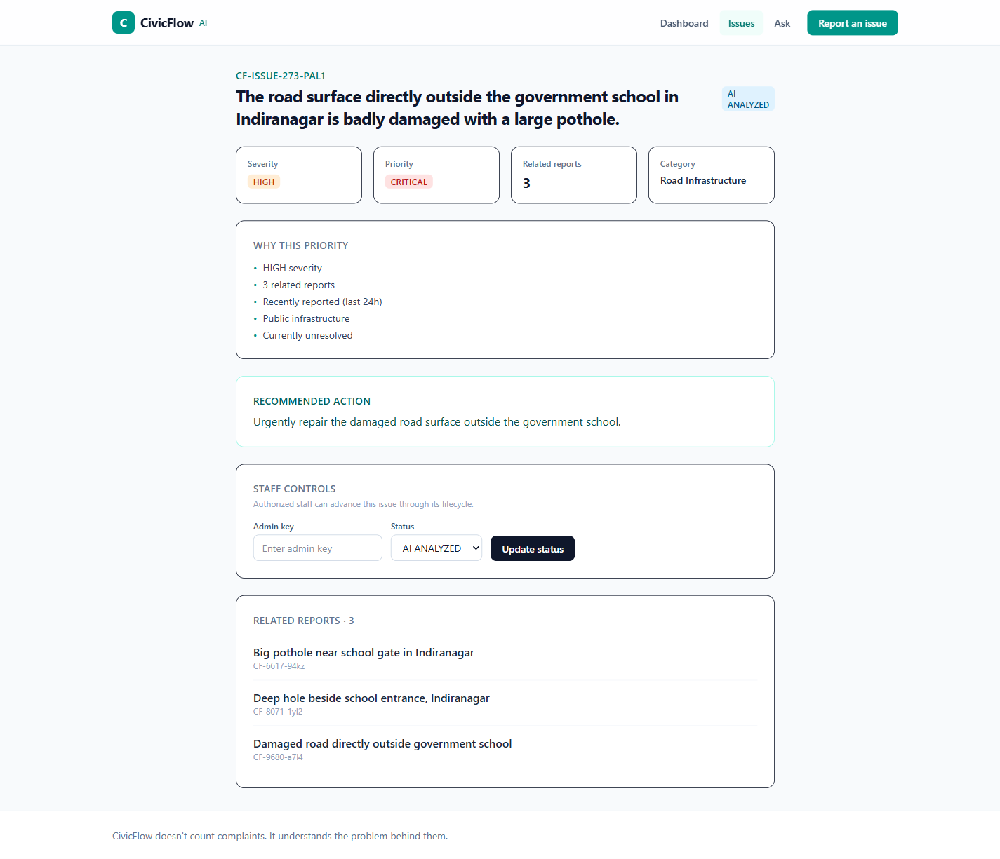

# CivicFlow AI

> **CivicFlow doesn't count complaints. It understands the problem behind them.**

AWS Zero to Shipped Hackathon · Category `#social-good` · Lane `#community`

**Live app:** https://d2ei9x9420h4oc.cloudfront.net

**Live API:** https://zwasktmpei.execute-api.us-east-1.amazonaws.com

CivicFlow AI is a multimodal community issue-to-action platform. Citizens report
real-world problems with text, an image, or both. The system analyzes the evidence,
identifies the underlying issue, estimates severity and confidence, detects potentially
duplicate reports, groups related reports into a single community issue, prioritizes it
transparently, and recommends a concrete action — all measured on a live dashboard.

## Why it matters

Communities drown in duplicate complaints about the same physical problem. Three people
report "a pothole near the school" three different ways, and the signal gets lost in the
noise. CivicFlow treats reports as **evidence of an underlying issue**, fuses that
evidence, and clusters related reports so staff see one prioritized problem — not three
disconnected tickets.

## What it does

Citizen evidence → multimodal AI analysis → evidence fusion → duplicate detection →
issue clustering → prioritization → recommended action → measurable community dashboard.

- **Multimodal evidence analysis** — Amazon Rekognition extracts visual evidence from
  photos; Amazon Bedrock (Nova) reasons over text + image + nearby reports and returns a
  structured assessment that separates **observed evidence**, **AI interpretation**, and
  **recommended action**.
- **Duplicate detection & clustering** — application-level similarity (semantic text
  overlap + category + location proximity) groups related reports into one community issue.
- **Transparent priority** — a deterministic factor model (severity, related report count,
  recency, public infrastructure, unresolved) that is explainable, not an opaque LLM guess.
- **Ask CivicFlow** — a real tool-using agent built on the **AWS Strands Agents SDK** that
  retrieves live data via tools before answering, so responses are grounded in facts, never
  invented statistics.
- **Community dashboard** — totals, category breakdown, status distribution, and duplicate
  clusters from real DynamoDB data.
- **Staff controls (closing the loop)** — authorized staff advance an issue through its
  lifecycle (NEW → AI_ANALYZED → VERIFIED → IN_PROGRESS → RESOLVED), gated by an admin key
  and audited to CloudWatch, so the community can track real progress to resolution.

## Architecture (serverless on AWS)

```
React (Vite/TS/Tailwind) → CloudFront + S3        (public site)
                               │
                         API Gateway (HTTP API)
                      ┌────────┴─────────┐
            Node 22 Lambda (API)   Python 3.12 Lambda (Strands agent, /ask)
                      │                   │
   DynamoDB · S3 images · Rekognition · Amazon Bedrock (Nova) · CloudWatch
```



See [`docs/ARCHITECTURE.md`](docs/ARCHITECTURE.md), [`docs/AI_PIPELINE.md`](docs/AI_PIPELINE.md),
and [`docs/API.md`](docs/API.md) for detail. The diagram above is also available as an
editable draw.io file: [`docs/architecture.drawio`](docs/architecture.drawio) (open in
[diagrams.net](https://app.diagrams.net)).

## Screenshots

| Dashboard | Report + AI analysis | Issue cluster |
|---|---|---|
|  |  |  |

More in [`docs/screenshots/`](docs/screenshots/) (report form, issues list, Ask CivicFlow).

## AWS services

Amazon S3, Amazon CloudFront, Amazon API Gateway, AWS Lambda (Node.js + Python),
Amazon DynamoDB, Amazon Bedrock (Amazon Nova), Amazon Rekognition, Amazon CloudWatch, AWS IAM.

## Repository layout

```
/infra          AWS CDK app (TypeScript) — all infrastructure
/backend        Node.js/TypeScript Lambda — API, AI pipeline, clustering, seed
/backend-agent  Python Lambda — AWS Strands Agents SDK (Ask CivicFlow)
/frontend       React + Vite + TypeScript + Tailwind SPA
/docs           Architecture, API, AI pipeline, deployment, demo, agent evidence, diagram
/.kiro/specs    Spec-driven requirements, design, and tasks
```

## Build the agent with Amazon Nova

The Ask agent uses the AWS Strands Agents SDK with Amazon Bedrock Nova. Because Strands
invokes Nova through a cross-region inference profile, the agent uses the
`us.amazon.nova-lite-v1:0` profile id (configurable via `AGENT_MODEL_ID`). The main API
Lambda uses the Converse API with `amazon.nova-lite-v1:0` (configurable via
`BEDROCK_MODEL_ID`).

## Deploy & run

See [`docs/DEPLOYMENT.md`](docs/DEPLOYMENT.md) for full steps. In short:

```powershell
cd infra;    npm install; npx cdk deploy --require-approval never `
  -c adminKey=<strong-secret> -c bedrockModelId=amazon.nova-lite-v1:0
# note outputs: ApiUrl, SiteBucket, SiteUrl, DistributionId, ImagesBucket, TableName

cd ../frontend
$env:VITE_API_BASE_URL="<ApiUrl>"; npm install; npm run build
aws s3 sync dist/ s3://<SiteBucket> --delete
aws cloudfront create-invalidation --distribution-id <DistributionId> --paths "/*"

cd ../backend
$env:DYNAMODB_TABLE="civicflow"; $env:IMAGES_BUCKET="<ImagesBucket>"; npm run seed
```

## Testing

- Backend: `cd backend; npm test` (Vitest — AI output validation, duplicate detection,
  priority, dashboard aggregation, malformed-model handling).
- Frontend: `cd frontend; npm test` (Vitest + Testing Library — report form validation,
  image upload validation).

## Staff controls (issue lifecycle)

Each issue moves through a lifecycle: `NEW → AI_ANALYZED → VERIFIED → IN_PROGRESS →
RESOLVED`. Citizens can view status; only authorized staff can advance it.

On any issue page (`/issues/<id>`) the **Staff controls** panel lets staff update status:
1. Enter the **admin key** (the `ADMIN_KEY` secret set at deploy time). The browser keeps
   it in `sessionStorage` for the session, so you enter it once.
2. Choose the new **status** from the dropdown.
3. Click **Update status**. On success the status badge refreshes and the dashboard's
   status distribution updates.

Under the hood this sends `PATCH /issues/{id}/status` with the key in the `x-admin-key`
header. The Lambda validates it against `ADMIN_KEY`; a correct key applies the change and
logs `ISSUE_STATUS_CHANGED` to CloudWatch, while a wrong/empty key returns `401` and changes
nothing. Update the key any time with `cdk deploy -c adminKey=<new-secret>`.

Advance a status straight from the API:
```powershell
$api="<ApiUrl>"
Invoke-WebRequest "$api/issues/<issueId>/status" -Method PATCH `
  -Headers @{ "x-admin-key" = "<admin-key>" } `
  -Body '{"status":"IN_PROGRESS"}' -ContentType "application/json" -UseBasicParsing
```

> MVP note: the shared-key check is intentionally simple. In production, put a real identity
> provider (e.g. Amazon Cognito) in front of staff actions — see `requirements.md`.

## Demo

See [`docs/DEMO.md`](docs/DEMO.md) for the full demo script. The core story: a citizen submits a report, the AI
analyzes the evidence, the system recognizes it as part of an existing issue, prioritizes
it, recommends an action, and the dashboard measures community progress.

## Hackathon submission

Category `#social-good` (focus: Climate resilience) · Lane `#community`. The full Builder
Center submission content — pitch, tags, requirement mapping, and ship-gate checklist — is
in [`docs/SUBMISSION.md`](docs/SUBMISSION.md).

## Built with Kiro

CivicFlow was built with the Kiro coding agent using a spec-driven workflow. See
[`docs/CODING_AGENT_EVIDENCE.md`](docs/CODING_AGENT_EVIDENCE.md) for how the agent generated the architecture, specs, code, AWS
integration, tests, and deployment, and how it diagnosed and fixed a real production bug.

## Contributing

Contributions are welcome. See [`CONTRIBUTING.md`](CONTRIBUTING.md) for setup, conventions,
required checks, and the pull request process.

## License

Licensed under the [MIT License](LICENSE) — Copyright (c) 2026 DineshRaj Dhanapathy@DD.
